# Contract Audit

`examples/contract_audit.py` is AgentFlow's manifest-driven contract-audit pipeline for `EVM + Solidity + Foundry`. The current public entrypoint is still this example file: there is no separate `agentflow audit-contract` command yet.

The pipeline reads a manifest from `AGENTFLOW_CONTRACT_AUDIT_MANIFEST`, materializes the target source tree, prepares a Foundry workspace, runs source-grounded review and PoC generation, and publishes a report bundle.

## Pipeline Overview

```mermaid
flowchart LR
  A[intake_target] --> B[materialize_target]
  B --> C[prepare_foundry_workspace]
  C --> D[surface_map]
  D --> E[audit_shard xN]
  E --> F[finding_reduce]
  F --> G[evidence_review]
  G --> H[evidence_gate]
  H --> I[poc_author]
  I --> J[poc_verify]
  J --> K[final_adjudication]
  K --> L[report_build]
  L --> M[report_review]
  M --> N[report_finalize_build]
  N --> O[package_readme_build]
  O --> P[publish_artifacts]
```



### Stage Summary

| Stage | Purpose | Main Output |
| --- | --- | --- |
| `intake_target` | Load and normalize the audit manifest. | Normalized manifest payload |
| `materialize_target` | Snapshot the local source tree or clone the pinned GitHub target. | `workspace/source_snapshot/` and `source_identifier` |
| `prepare_foundry_workspace` | Build a runnable Foundry workspace from the materialized source. | `workspace/foundry_project/` |
| `surface_map` | Produce a structured map of privilege, initialization, accounting, and call surfaces. | Surface-map analysis |
| `audit_shard xN` | Run parallel audit tracks over the prepared workspace. | Candidate findings per track |
| `finding_reduce` | Deduplicate and normalize candidate findings. | Canonical candidate set |
| `evidence_review` | Re-check candidates against source evidence. | Reviewed findings |
| `evidence_gate` | Keep only confirmed findings and mark PoC eligibility. | Validated findings set |
| `poc_author` | Write Foundry PoC tests for the best PoC-eligible findings. | `test/security/*.t.sol` |
| `poc_verify` | Run `forge build` and `forge test -vvv`. | Verification result JSON |
| `final_adjudication` | Combine validated findings with PoC results. | Final canonical findings JSON |
| `report_build` | Render the draft report bundle. | Draft `AUDIT_REPORT.md`, `findings.json`, `audit_summary.json`, `report_manifest.json` |
| `report_review` | Perform delivery-level review, reject impossible findings, and merge duplicates. | Final reviewed findings JSON |
| `report_finalize_build` | Re-render the final report bundle after review. | Final `AUDIT_REPORT.md`, `findings.json`, `audit_summary.json`, `report_manifest.json` |
| `package_readme_build` | Render the customer-facing package landing page. | Root `README.md` |
| `publish_artifacts` | Emit the final artifact paths for downstream use. | Artifact index JSON |

### Built-In Audit Tracks

`run.parallel_shards` controls how many of the built-in tracks run in parallel. The current pipeline defines these tracks, in order:

1. `access-control-and-init`
2. `accounting-and-rounding`
3. `reentrancy-and-external-calls`
4. `state-machine-and-epoch-flow`
5. `upgradeability-migration-storage-layout`
6. `integration-trust-boundaries`

If `parallel_shards` is `6`, all built-in tracks run.

## Quick Start: Cap Vault

This section uses the real Cap Vault engagement package stored under `/data/agentenv/agentflow-audit-reports/solv/cap-vault-reports`.

### 1. Prepare the Input Data

For a real audit run, prepare these inputs:

1. A source tree to audit.
2. A manifest JSON file describing the target, scope, output directory, and PoC policy.
3. A Foundry installation available on `PATH`, because the pipeline verifies PoCs with `forge build` and `forge test`.

For the Cap Vault run, the prepared inputs were:

- Source tree: `/data/agentenv/agentflow-audit-reports/solv/cap-vault`
- Manifest: `/data/agentenv/agentflow-audit-reports/solv/cap-vault-reports/contract_audit_manifest.json`
- Report package root: `/data/agentenv/agentflow-audit-reports/solv/cap-vault-reports`

The exact manifest used for this engagement was:

```json
{
  "target": {
    "source": {
      "kind": "local",
      "local_path": "/data/agentenv/agentflow-audit-reports/solv/cap-vault"
    },
    "report": {
      "project_name": "Cap Vault",
      "audit_scope": "src/contracts/vault"
    },
    "chain_context": {
      "chain": "ethereum",
      "contract_address_url": "https://etherscan.io/address/0xdd649adab2e67cadc2ec29d75abe73f3df08065c",
      "creation_tx_url": "https://etherscan.io/tx/0xd68c257d4226b868acb17a7f7678e732818330fc2c50028d733dfbcd4e221a87"
    }
  },
  "run": {
    "artifacts_dir": "/data/agentenv/agentflow-audit-reports/solv/cap-vault-reports/artifacts",
    "parallel_shards": 6
  },
  "policy": {
    "allow_source_confirmed_without_poc": true,
    "max_poc_candidates": 5
  }
}
```

### 2. Validate the Manifest

Run validation first from the AgentFlow repository root:

```bash
AGENTFLOW_CONTRACT_AUDIT_MANIFEST=/data/agentenv/agentflow-audit-reports/solv/cap-vault-reports/contract_audit_manifest.json \
PATH="$HOME/.foundry/bin:$PATH" \
/data/agentenv/agentflow/.venv/bin/python -m agentflow.cli validate examples/contract_audit.py
```

This checks that the manifest shape, source configuration, scope path, artifact directory, and policy values are acceptable before the audit starts.

### 3. Run the Audit

The real Cap Vault run used this command:

```bash
AGENTFLOW_CONTRACT_AUDIT_MANIFEST=/data/agentenv/agentflow-audit-reports/solv/cap-vault-reports/contract_audit_manifest.json \
PATH="$HOME/.foundry/bin:$PATH" \
/data/agentenv/agentflow/.venv/bin/python -m agentflow.cli run examples/contract_audit.py \
  --runs-dir /data/agentenv/agentflow-audit-reports/solv/cap-vault-reports/runs \
  --output summary \
  --progress off
```

This specific run:

- Started at `2026-04-08T12:38:21Z`
- Ended at `2026-04-08T13:22:43Z`
- Finished in `44m 21s`
- Produced run id `ee042ee303ec4b6c861fd5ba72bed478`

### 4. What the Pipeline Produced for Cap Vault

The completed run reported:

- `4 total` findings
- `2 high`, `2 medium`, `2 low`
- `6 PoC Confirmed`, `0 Source Confirmed`

Final finding IDs:

- `CAN-01` High, PoC Confirmed
- `CAN-02` High, PoC Confirmed
- `CAN-03` Medium, PoC Confirmed
- `CAN-04` Medium, PoC Confirmed
- `CAN-05` Low, PoC Confirmed
- `CAN-06` Low, PoC Confirmed

### 5. Deliverables

The Cap Vault engagement produced these deliverables under `/data/agentenv/agentflow-audit-reports/solv/cap-vault-reports`:

| Path | Purpose |
| --- | --- |
| `README.md` | Customer-facing landing page summarizing scope, verification, deliverables, and key findings. |
| `contract_audit_manifest.json` | The exact manifest used for the run. |
| `artifacts/report/AUDIT_REPORT.md` | Human-readable audit report for delivery. |
| `artifacts/report/findings.json` | Canonical machine-readable finding records. |
| `artifacts/report/audit_summary.json` | Summary JSON with counts and engagement metadata. |
| `artifacts/report/report_manifest.json` | Report-safe manifest used for rendering. |
| `artifacts/workspace/source_snapshot/` | Materialized source snapshot used by the run. |
| `artifacts/workspace/foundry_project/` | Runnable Foundry workspace used for review and PoC verification. |
| `artifacts/workspace/foundry_project/test/security/VaultPoC.t.sol` | Generated PoC test covering PoC-confirmed issues. |
| `runs/ee042ee303ec4b6c861fd5ba72bed478/` | Full node-level execution record for the audit session. |

Inside the run directory, AgentFlow also persisted per-node logs and traces such as:

- `artifacts/surface_map/`
- `artifacts/audit_shard_0/` through `artifacts/audit_shard_5/`
- `artifacts/finding_reduce_0/`
- `artifacts/evidence_review/`
- `artifacts/evidence_gate/`
- `artifacts/poc_author/`
- `artifacts/poc_verify/`
- `artifacts/final_adjudication/`
- `artifacts/report_build/`
- `artifacts/report_review/`
- `artifacts/report_finalize_build/`
- `artifacts/package_readme_build/`
- `artifacts/publish_artifacts/`

## Manifest and Command Template

When auditing a new project, the input you prepare is a manifest JSON file. The pipeline reads it from `AGENTFLOW_CONTRACT_AUDIT_MANIFEST`.

### Local Source Tree Template

```json
{
  "target": {
    "source": {
      "kind": "local",
      "local_path": "/absolute/path/to/source-tree"
    },
    "report": {
      "project_name": "Project Name",
      "audit_scope": "src/contracts/vault"
    },
    "chain_context": {
      "chain": "ethereum",
      "contract_address_url": "https://etherscan.io/address/0x...",
      "creation_tx_url": "https://etherscan.io/tx/0x..."
    }
  },
  "run": {
    "artifacts_dir": "/absolute/path/to/report-package/artifacts",
    "parallel_shards": 6
  },
  "policy": {
    "allow_source_confirmed_without_poc": true,
    "max_poc_candidates": 5
  }
}
```

### GitHub + Commit Template

```json
{
  "target": {
    "source": {
      "kind": "github",
      "repo_url": "https://github.com/org/repo",
      "commit": "0123456789abcdef0123456789abcdef01234567"
    },
    "report": {
      "project_name": "Project Name",
      "audit_scope": "src/contracts/vault"
    }
  },
  "run": {
    "artifacts_dir": "/absolute/path/to/report-package/artifacts",
    "parallel_shards": 6
  },
  "policy": {
    "allow_source_confirmed_without_poc": true,
    "max_poc_candidates": 5
  }
}
```

### Manifest Fields

| Field | Meaning |
| --- | --- |
| `target.source.kind` | Source intake mode. Supported values are `local` and `github`. |
| `target.source.local_path` | Local source tree path. Relative values are resolved from the manifest file directory. |
| `target.source.repo_url` | GitHub repository URL for `github` intake mode. |
| `target.source.commit` | Pinned commit SHA for `github` intake mode. |
| `target.report.project_name` | Display name used in the report bundle. |
| `target.report.audit_scope` | Report-safe relative path inside the target source tree. This is what appears in the rendered report. |
| `target.chain_context.chain` | Optional chain label such as `ethereum`. |
| `target.chain_context.contract_address_url` | Optional explorer link for the deployed contract. |
| `target.chain_context.creation_tx_url` | Optional explorer link for the creation transaction. |
| `run.artifacts_dir` | Output root for generated artifacts. Can be relative to the pipeline working directory or an absolute path. |
| `run.parallel_shards` | Maximum number of built-in audit tracks to execute in parallel. |
| `policy.allow_source_confirmed_without_poc` | Whether source-confirmed findings may ship without a successful PoC. |
| `policy.max_poc_candidates` | Upper bound on how many findings the pipeline will attempt to turn into PoC tests. |

### Standard Command Sequence

Once the manifest exists, the normal command sequence is:

1. Validate:

```bash
AGENTFLOW_CONTRACT_AUDIT_MANIFEST=/absolute/path/to/contract_audit_manifest.json \
PATH="$HOME/.foundry/bin:$PATH" \
/data/agentenv/agentflow/.venv/bin/python -m agentflow.cli validate examples/contract_audit.py
```

2. Run:

```bash
AGENTFLOW_CONTRACT_AUDIT_MANIFEST=/absolute/path/to/contract_audit_manifest.json \
PATH="$HOME/.foundry/bin:$PATH" \
/data/agentenv/agentflow/.venv/bin/python -m agentflow.cli run examples/contract_audit.py \
  --runs-dir /absolute/path/to/runs \
  --output summary \
  --progress off
```

3. Review the generated report bundle under `run.artifacts_dir/report/`.

## Artifact Layout

A typical output layout looks like this:

```text
<artifacts_dir>/
  workspace/
    source_snapshot/
    foundry_project/
  report/
    AUDIT_REPORT.md
    findings.json
    audit_summary.json
    report_manifest.json
```

For `github + commit` intake mode, AgentFlow may also create a clone staging directory before materializing the final source snapshot. For `local` intake mode, the source tree is materialized directly into `workspace/source_snapshot/`.

## Safety Notes

- The rendered report uses `target.report.audit_scope`, not an absolute local filesystem path, for scope text.
- `AUDIT_REPORT.md` is intended to stay report-safe even when the run writes into a private local reports repository.
- Local debug paths, scratch files, and other environment-specific notes should stay outside the committed report bundle.

## Current Scope

- Supported stack: `EVM + Solidity + Foundry`
- Supported source intake: local trees and pinned `github + commit`
- PoC verification backend: Foundry
